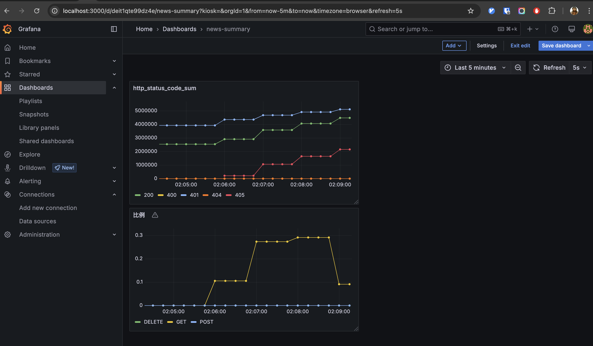
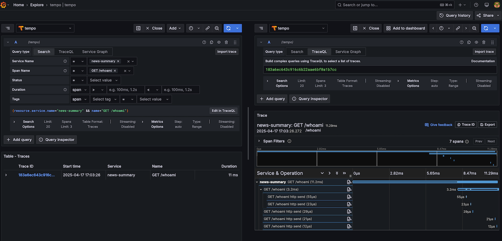
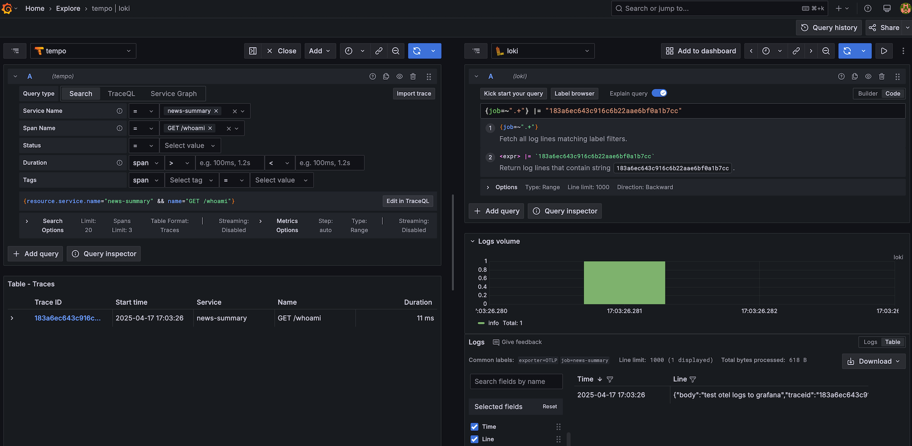

# 📰 News-Summary

[](https://codecov.io/gh/wsgggws/news-summary)

**AI 生成个性化新闻摘要**，并将在 [Bilibili](https://space.bilibili.com/472722204?spm_id_from=333.1007.0.0) 上进行分享，敬请期待！🚀

---

## 🎯 **项目目标**

- 爬取用户订阅的 RSS 新闻源。
- 使用 AI 生成简短摘要。
- 根据用户阅读历史，个性化推荐相关新闻。
- 监控 API 请求量、摘要生成成功率。
- 设定告警规则，如 API 失败率高于 20% 触发警报。
- 支持单元测试及测试报告。
- 集成 CICD 流水线，自动化部署。

---

## 🚀 **核心功能**

- [x] 用户身份验证 & 登录
- [x] 单元测试（Pytest）
- [x] 新闻订阅
- [ ] Dynaconf（配置管理）
- [ ] 错误追踪 & 报警机制（Sentry + Prometheus + Grafana）
- [ ] 新闻爬取 & 存储（asyncio + aiohttp + parsel）
- [ ] AI 生成摘要（GPT / Hugging Face）
- [ ] 个性化推荐（TF-IDF / 余弦相似度）
- [ ] API 限流 & 身份认证（JWT）
- [ ] Redis 缓存（新闻数据与个性化推荐）
- [ ] Docker 一键启动

---

## 🛠 **技术栈**

| **技术**           | **描述**                          |
| ------------------ | --------------------------------- |
| **开发语言**       | Python 3.11                       |
| **包管理**         | Poetry 2.1.0                      |
| **后端框架**       | FastAPI                           |
| **数据库**         | PostgreSQL + SQLAlchemy（ORM）    |
| **任务队列**       | Celery + aioredis（异步任务处理） |
| **配置管理**       | Dynaconf                          |
| **新闻爬取与解析** | Asyncio + aiohttp + parsel        |
| **单元测试**       | Pytest                            |
| **AI 组件**        | OpenAI GPT / Hugging Face（待定） |
| **监控**           | Opentelemetry + Grafana           |
| **错误追踪**       | Sentry                            |
| **API 认证**       | JWT（身份验证）                   |
| **API 限流**       | SlowAPI（请求频率限制）           |
| **日志管理**       | Loguru + Loki                     |
| **部署方式**       | Docker Compose                    |

---

## 🚀 **如何本地运行**

```sh
pip install poetry==1.4.2
poetry install
cp env.sample .env
docker-compose up -d
uvicorn app.main:app --reload
```

<details>
<summary>
   Zero code opentelemetry-instrument 启动
</summary>

```sh
# 注意不要使用 --reload 启动，不然没有 console 输出
docker compose up -d
set -a
source .otel.env
set +a
opentelemetry-instrument uvicorn app.main:app
```





</details>

---

## 🧪 **测试**

```sh
pip install poetry==1.4.2
poetry install
docker-compose up -d
export PYTHONPATH=. && pytest tests -vv -s # 运行所有测试文件, -s 表示 print() 的内容也显示
```

---

## 📡 **API 接口文档**

- 📌 访问 API 文档：[Swagger UI](http://127.0.0.1:8000/docs)
- 📌 后续将提供 Postman 请求案例
