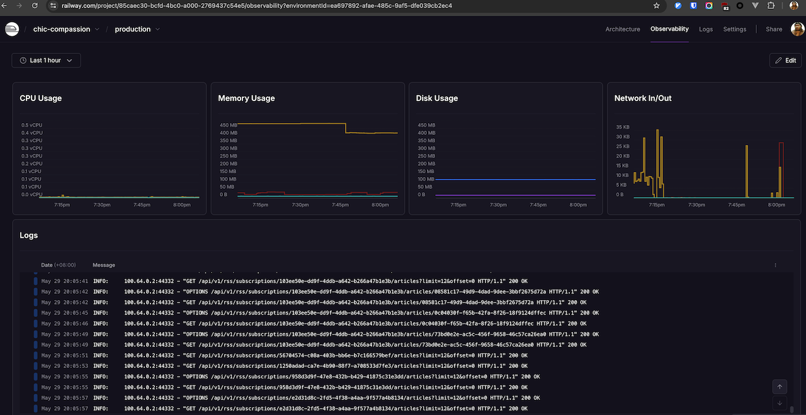

# 📰 News-Summary


[](https://codecov.io/gh/wsgggws/news-summary)

**AI 生成个性化新闻摘要**，并在 [Bilibili](https://space.bilibili.com/472722204?spm_id_from=333.1007.0.0) 有合集分享，敬请期待！🚀

## 前后端体验(PC体验较好，移动UI还未适应)

- <https://news-summary-front.onrender.com/>

**注册** 或者使用如下用户密码

- username: 码码要洗手
- password: Mmyxs;!1



---

## 🎯 **项目目标**

- 爬取用户订阅的 RSS 新闻源。
- 使用 AI 生成简短摘要。
- 根据用户阅读历史，个性化推荐相关新闻。
- 监控 API 请求量、摘要生成成功率。
- 设定告警规则，如 API 失败率高于 20% 触发警报。
- 支持单元测试及测试报告。
- 集成 CICD 流水线，自动化部署。

---

## 🚀 **核心功能**

- [x] 用户身份验证 & 登录
- [x] API 限流 & 身份认证（JWT）
- [x] 单元测试（Pytest）
- [x] 新闻订阅
- [x] 监控 Metrics（OpenTelemetry + otel-collector + Prometheus + Grafana）
- [x] 监控 Traces（OpenTelemetry + otel-collector + Tempo + Grafana）
- [x] 监控 Logs（OpenTelemetry + otel-collector + Loki + Grafana）
- [x] pydantic-settings（配置管理）
- [x] 新闻爬取 & 存储（Celery + asyncio + aiohttp + parsel）
- [x] AI 生成摘要（DeepSeek API）
- [ ] 错误追踪 （Sentry ）
- [ ] 个性化推荐（TF-IDF / 余弦相似度）
- [ ] Redis 缓存（新闻数据与个性化推荐）
- [ ] Docker 一键启动

---

## 🛠 **技术栈**

| **技术**           | **描述**                                              |
| ------------------ | ----------------------------------------------------- |
| **开发语言**       | Python 3.11                                           |
| **包管理**         | Poetry 2.1.2                                          |
| **后端框架**       | FastAPI                                               |
| **数据库**         | PostgreSQL + SQLAlchemy（ORM）                        |
| **任务队列**       | Celery + aioredis（异步任务处理）                     |
| **配置管理**       | pydantic-settings                                     |
| **新闻爬取与解析** | Asyncio + aiohttp + parsel                            |
| **单元测试**       | Pytest                                                |
| **AI 组件**        | TODO                                                  |
| **监控 Metrics**   | OpenTelemetry + otel-collector + Prometheus + Grafana |
| **监控 Traces**    | OpenTelemetry + otel-collector + Tempo + Grafana      |
| **监控 Logs**      | OpenTelemetry + otel-collector + Loki + Grafana       |
| **错误追踪**       | Sentry                                                |
| **API 认证**       | JWT（身份验证）                                       |
| **API 限流**       | SlowAPI（请求频率限制）                               |
| **部署方式**       | Docker Compose                                        |

---

## 环境安装

### Python3.11

推荐使用 [Miniconda](https://www.anaconda.com/docs/getting-started/miniconda/main) 进行 Python 版本管理

### [Poetry](https://python-poetry.org/docs/)

```sh
curl -sSL https://install.python-poetry.org | python3 - --version 2.1.2
```

---

## 🚀 **如何本地运行**

```sh
# 启动 WebAPI
make run
```

```sh
# 启动 Celery beat and 2 workers
make start-celery

# 停止 Celery beat and 2 workers
make stop-celery
```

由于会使用到 AI 功能，可在 .env 文件里添加相关环境变量，
否则订阅的总结(summary_md) 字段将不会有内容生成, 其它功能正常

```.env
LLM_API_KEY="XXX"
LLM_BASE_URL="https://xxx"
LLM_MODEL="YYY"
```

<details>
<summary>
OpenTelemetry-Instrument 启动, 并观测 Metrics, Traces, Logs
</summary>

```sh
# 注意没有也不建议使用 --reload 启动
make otel-run
```


</details>

---

## 🧪 **测试**

```sh
make test # 运行所有测试文件
make test ARGS="-vv -s" # 运行所有测试文件, -s 表示 print() 的内容也显示
make test ARGS="tests/test_whoami -vv -s" # 运行单个文件, 并显示输出
```

---

## 📡 **API 接口文档**

- 📌 访问 API 文档：[Swagger UI](http://127.0.0.1:8000/docs)
- 📌 后续将提供 Postman 请求案例
